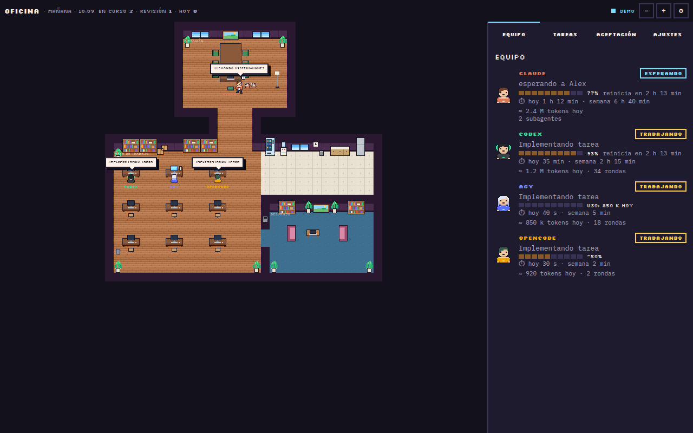
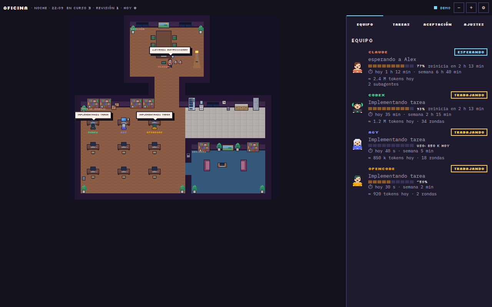

# ia-delegate-pixel

**Una oficina de inteligencias artificiales que trabajan juntas en tus proyectos de código.**
Una IA dirige y revisa; las otras programan. Y todo lo puedes ver en una oficina pixel art.



> 📖 Este README tiene dos partes. La **primera** es para personas que nunca han usado algo así: explica qué es,
> cómo instalarlo paso a paso y cómo usarlo. La **segunda** ([Explicación técnica](#explicación-técnica)) es para
> quien quiera entender o modificar el código.

---

## Índice

1. [¿Qué es esto?](#qué-es-esto)
2. [¿Para qué me sirve?](#para-qué-me-sirve)
3. [¿Cómo funciona? (sin tecnicismos)](#cómo-funciona-sin-tecnicismos)
4. [Palabras que vas a leer](#palabras-que-vas-a-leer)
5. [Qué necesitas antes de instalar](#qué-necesitas-antes-de-instalar)
6. [Instalación paso a paso](#instalación-paso-a-paso)
7. [Cómo usarlo día a día](#cómo-usarlo-día-a-día)
8. [La oficina](#la-oficina)
9. [Encender y apagar](#encender-y-apagar)
10. [Preguntas frecuentes](#preguntas-frecuentes)
11. [Explicación técnica](#explicación-técnica)

---

## ¿Qué es esto?

Hoy hay varias inteligencias artificiales que saben programar: **Claude** (de Anthropic), **Codex** (de OpenAI,
viene con ChatGPT) y **Antigravity / `agy`** (de Google, viene con Google AI Pro). Si pagas más de una, normalmente
usas solo una a la vez y desperdicias las demás.

**ia-delegate-pixel las pone a trabajar en equipo**, como en una oficina:

- 👩‍💼 **La jefa (la "IA maestra")** — por defecto Claude. Habla contigo, entiende lo que quieres, decide cómo debe
  verse, escribe instrucciones claras y **revisa** el trabajo antes de que llegue a tu proyecto.
- 👩‍💻 **Las programadoras (los "agentes")** — agy y Codex. Reciben las instrucciones, escriben el código y entregan.

Tú solo hablas con la jefa. Ella reparte el trabajo, lo revisa y te avisa cuando está listo.

## ¿Para qué me sirve?

- **Aprovechas lo que ya pagas.** Si tienes ChatGPT y Google AI Pro, Codex y agy trabajan en lugar de quedarse sin
  usar.
- **Ahorras en la IA más cara.** La jefa gasta sus mensajes en pensar, diseñar y revisar; el código rutinario lo
  escriben las otras.
- **Tu proyecto está protegido.** Nadie toca tu código hasta que la jefa revisa y aprueba. Si algo sale mal, se tira
  a la basura sin consecuencias.
- **El diseño se respeta.** La jefa define colores, tamaños y textos exactos; las programadoras los copian al pie de
  la letra en lugar de inventar su propio estilo.
- **Ves todo lo que pasa** en la oficina pixel: quién trabaja, quién descansa, cuánto le queda de uso a cada IA y
  cuánto tiempo ha trabajado.

## ¿Cómo funciona? (sin tecnicismos)

Imagina que le pides a la jefa: *"agrega un buscador a mi tienda en línea"*.

1. **La jefa escribe una orden de trabajo** con lo que hay que hacer y cómo saber que quedó bien.
2. **La jefa elige quién lo hace:** si es algo simple y bien delimitado, se lo da a **agy**; si es complejo, a
   **Codex**. Luego camina a su escritorio y le entrega la orden (¡lo ves en la oficina!).
3. **La programadora trabaja en una copia aparte de tu proyecto.** Tu versión original no se toca.
4. **Se revisa automáticamente.** Si tu proyecto tiene pruebas, se ejecutan solas. Si algo falla, recibe el
   error y lo corrige.
5. **Si agy no puede después de 2 intentos, pasa a Codex**, y si Codex tampoco, a la jefa.
6. **agy (o Codex) camina a la oficina de la jefa y le entrega el trabajo.** La jefa lo revisa:
   - ✅ Si está bien, lo integra a tu proyecto.
   - ✏️ Si le falta algo, se lo regresa con correcciones precisas.
   - 🗑️ Si no sirve, lo descarta.

```
   Tú ──pides──▶ 👩‍💼 Jefa ──orden──▶ 👩‍💻 agy ──(2 intentos)──▶ 👩‍💻 Codex ──▶ 👩‍💼 Jefa
                     ▲                    │                        │
                     └──────── entrega ───┴────────────────────────┘
                     revisa ▶ ✅ integra / ✏️ corrige / 🗑️ descarta
```

## Palabras que vas a leer

| Palabra | Qué significa |
|---|---|
| **Terminal** | La ventana negra donde se escriben comandos. En Ubuntu: `Ctrl + Alt + T`. En Mac: app "Terminal". |
| **Comando** | Una instrucción que escribes en la terminal y ejecutas con `Enter`. |
| **CLI** | Un programa que se usa desde la terminal (por ejemplo `codex`, `agy` o `claude`). |
| **Repositorio (repo)** | La carpeta de un proyecto con historial de cambios (usa **git**). |
| **Rama / worktree** | Una copia aparte del proyecto donde se trabaja sin tocar el original. |
| **Commit** | Un "punto de guardado" del proyecto en git. |
| **Diff** | La lista exacta de lo que cambió en el código. |
| **Pruebas / checks** | Programas que revisan solos que tu código funcione (por ejemplo `npm test`). |
| **IA maestra** | La IA que dirige y revisa (por defecto Claude). Se puede cambiar. |
| **Agente** | Una IA que recibe tareas y programa (agy, Codex u otra que agregues). |
| **Token** | La "moneda" con que las IAs miden cuánto trabajan. Más tokens = más uso de tu plan. |
| **Cuota** | Cuánto puedes usar una IA antes de que tu plan te pida esperar. |

## Qué necesitas antes de instalar

**Sistema:** Linux o macOS. (Windows puede funcionar dentro de **WSL**, pero no está probado.)

Abre la terminal y revisa cada cosa. Si un comando responde con un número de versión, ya lo tienes.

| Necesitas | Cómo revisar | Si no lo tienes |
|---|---|---|
| **Python 3.11 o más nuevo** | `python3 --version` | Ubuntu: `sudo apt install python3` · Mac: [python.org](https://www.python.org/downloads/) |
| **git** | `git --version` | Ubuntu: `sudo apt install git` · Mac: `xcode-select --install` |
| **Al menos 2 IAs** (una que dirija y una que programe) | ver abajo | ver abajo |

Las IAs (con su cuenta de pago correspondiente):

| IA | Cómo revisar | Cómo instalar |
|---|---|---|
| **Claude Code** | `claude --version` | `curl -fsSL https://claude.ai/install.sh \| bash` (o usa la app Claude Desktop) |
| **Codex** (ChatGPT) | `codex --version` | `npm i -g @openai/codex` (necesita [Node.js](https://nodejs.org)) |
| **Antigravity** (Google AI Pro) | `agy --version` | sigue [la guía oficial](https://antigravity.google/docs/cli) |

> 💡 No necesitas las tres. El instalador detecta cuáles tienes y trabaja con esas.

## Instalación paso a paso

**1. Descarga el proyecto.** En la terminal:

```bash
git clone https://github.com/cesar1295/ia-delegate-pixel.git ~/ia-delegate-pixel
```

**2. Ejecuta el instalador:**

```bash
python3 ~/ia-delegate-pixel/ai_delegate.py setup
```

El instalador te va a:
- mostrar qué IAs encontró en tu computadora,
- preguntar **cuál quieres que sea la jefa** (recomendado: Claude) y **tu nombre**,
- configurar todo lo necesario, **guardando una copia de respaldo** de cada archivo que modifique.

> 🔍 ¿Quieres ver qué haría sin que cambie nada? Agrega `--dry-run`:
> `python3 ~/ia-delegate-pixel/ai_delegate.py setup --dry-run`

**3. Si el instalador te lo pide**, agrega `~/.local/bin` a tu PATH (te dice la línea exacta) y abre una terminal
nueva.

**4. Inicia sesión en cada IA** (solo la primera vez; el instalador te recuerda cuáles faltan):

```bash
codex login
```

Para agy, ábrelo con `agy` y sigue los pasos en pantalla. Para Claude, abre `claude` una vez (si usas Claude
Desktop, ya está).

**5. Verifica que todo funcione:**

```bash
ai-delegate doctor --live
```

Verás una lista de ✓ y ✗. Cada ✗ viene con una línea que explica cómo arreglarlo.
(La opción `--live` le manda un "OK" de prueba a cada IA, así que usa un poquito de tu plan.)

**6. (Opcional) Deja la oficina siempre encendida** en segundo plano:

```bash
ai-delegate ui --service install
```

¡Listo! 🎉

## Cómo usarlo día a día

### Forma recomendada: pídeselo a la jefa

Abre **Claude Desktop** (o `claude` en la terminal) **dentro de la carpeta de tu proyecto** y pide lo que necesites
con tus palabras:

- *"Agrega un filtro por talla al catálogo"*
- *"Diseña la sección de servicios de mi página"*
- *"Arregla el error del carrito que no suma el envío"*
- *"Escribe pruebas para el cálculo de precios"*

La jefa decide qué delega, a quién, lo revisa y te cuenta el resultado. No tienes que escribir ningún comando.

> ✅ **Dos consejos:** guarda tus cambios con un *commit* antes de pedir algo grande (las programadoras parten del
> último commit), y si tu proyecto tiene pruebas, mejor: las programadoras se corrigen solas con ellas.

### Si quieres usarlo tú directamente (terminal)

```bash
ai-delegate --dir ~/mi-proyecto "agrega validación al formulario de contacto"
```

| Comando | Para qué |
|---|---|
| `ai-delegate list` | Ver las tareas recientes y su estado |
| `ai-delegate diff last --stat` | Ver qué archivos cambió la última tarea |
| `ai-delegate feedback last "corrige X"` | Regresarla con correcciones |
| `ai-delegate merge last` | Aceptarla e integrarla a tu proyecto |
| `ai-delegate discard last` | Descartarla |
| `ai-delegate stats` | Ver quién acierta más, cuánto tiempo y tokens ha usado cada IA |
| `ai-delegate ui` | Abrir la oficina |
| `ai-delegate doctor` | Revisar que todo esté bien instalado |
| `ai-delegate master codex` | Cambiar la jefa (también `claude` o `agy`) |

`last` significa "la tarea más reciente"; también puedes usar el identificador que aparece en `list`.

## La oficina

Ábrela con `ai-delegate ui` o entra a **http://127.0.0.1:8765** en tu navegador.



**Las salas:**

| Sala | Qué significa |
|---|---|
| 🏛️ **Dirección** | Donde trabaja la jefa. Ahí le entregan las tareas terminadas. |
| 💻 **Área de trabajo** | Un escritorio por IA. El monitor muestra código cuando trabaja, amarillo cuando corren las pruebas, rojo si algo falló. |
| ☕ **Cocina** | Ahí espera la IA que se quedó sin cuota. |
| 🛋️ **Descanso** | Ahí descansan las IAs libres o "dormidas". |

**Detalles que vas a ver:**
- 🚶 Las IAs **caminan** para entregar órdenes y trabajos.
- ☕ La **taza de café** de cada escritorio muestra cuánta cuota le queda (se vacía y cambia de color).
- 👶 Los personajes pequeños junto a un escritorio son **subagentes** (ayudantes que una IA lanzó).
- 🌅 La ventana cambia según la **hora del día**: madrugada, mañana, tarde, atardecer y noche.

**Las pestañas:**
- **Equipo:** estado, cuota, tokens usados y **tiempo de trabajo** de cada IA.
- **Tareas:** las tareas recientes. Haz clic en una para ver el resumen y los comandos para revisarla.
- **Aceptación:** qué porcentaje de trabajo aprueba cada IA a la primera, y su tiempo total.
- **Ajustes:** cambia la jefa, tu nombre, a quién pasa una tarea si una IA no la resuelve, cuántas correcciones antes de pasarla, los
  **permisos** de cada IA y prueba las conexiones. Todo sin tocar archivos.

**Verla al lado de tu editor:**
- **Claude Desktop:** pídele a Claude "abre la oficina" y aparece en el panel lateral.
- **VS Code:** `Ctrl + Shift + P` → *Simple Browser: Show* → `http://127.0.0.1:8765`.
- **Ventana propia:** `ai-delegate ui --app`.

## Encender y apagar

| Quiero… | Comando |
|---|---|
| Apagar la oficina por ahora | `systemctl --user stop ai-delegate-ui` |
| Volver a encenderla | `systemctl --user start ai-delegate-ui` |
| Que no arranque al iniciar sesión | `ai-delegate ui --service uninstall` |
| Que arranque sola al iniciar sesión | `ai-delegate ui --service install` |
| Ver si está encendida | `ai-delegate ui --service status` |

(En Mac los comandos `systemctl` no existen: usa las opciones `--service`.)

**Que la jefa deje de delegar:** en una conversación, dile *"en esta sesión no delegues"*. Para todas las
conversaciones, abre el archivo de instrucciones de la jefa (para Claude: `~/.claude/CLAUDE.md`) y borra lo que está
entre las marcas `ai-delegate:start` y `ai-delegate:end`. Para reactivarlo, vuelve a ejecutar `ai-delegate setup`.

## Preguntas frecuentes

**¿Gasta mi plan si no lo estoy usando?**
No. Nada corre por su cuenta: solo trabaja cuando le pides algo. La oficina solo muestra lo que pasa.

**¿Puede romper mi proyecto?**
Las programadoras trabajan en una copia aparte. Tu proyecto solo cambia cuando la jefa (o tú) aprueba con `merge`, y
eso queda como un commit normal que puedes deshacer.

**¿Ve mis contraseñas?**
La herramienta **bloquea** el envío de textos que parezcan contraseñas o llaves y reemplaza correos, teléfonos y
tarjetas por marcadores. Nunca lee ni guarda las sesiones de las IAs. Ojo: las IAs sí pueden leer los archivos de tu
proyecto (por ejemplo un `.env`), así que no guardes secretos en el proyecto.

**¿Qué pueden hacer las IAs en mi computadora?**
Lo decides tú en **Ajustes → Agentes → Permisos**. Por defecto: Codex edita solo dentro de su copia y sin internet;
agy edita archivos y solo puede usar comandos de lectura. Nunca pueden usar `rm`, `sudo`, `git push` ni similares.

**¿Necesito las tres IAs?**
No. Con una jefa y al menos una programadora es suficiente.

**Algo no funciona.**
Ejecuta `ai-delegate doctor`: cada ✗ explica cómo arreglarlo.

---

## Explicación técnica

### Arquitectura

`ai-delegate` es una CLI en **Python ≥3.11 sin dependencias** (solo librería estándar) más una interfaz web estática.

```
Maestra (Claude/Codex/agy)
   │  ai-delegate run --kind feature "spec"
   ▼
--to elegido por la maestra (o routing) ──► runner (codex | agy | claude | generic)
   │                                                            │ subproceso con entorno limpio
   ▼                                                            ▼
worktree git aislado (rama ai/<id>) ◄──── el agente edita ────  stream JSON → events.jsonl
   │
   ▼
checks (npm/pnpm/yarn/bun/pytest) ──falla──► corrección automática (hasta N) ──► escalamiento
   │ ok
   ▼
reporte corto ──► la maestra revisa ──► feedback | escalate | merge | discard
```

| Módulo | Responsabilidad |
|---|---|
| `cli.py`, `args.py` | Comandos y argumentos |
| `routing.py`, `escalation.py` | A quién va cada tarea, estrategias routing / agy-first, cadena de escalamiento |
| `runners/` | Un runner por CLI: `codex exec --json`, `agy -p --output-format stream-json`, `claude -p --output-format stream-json`, y `generic` (texto plano) |
| `loop.py` | Ronda del agente → checks → correcciones → escalamiento; reintento si a agy le niegan un permiso |
| `worktree.py` | Worktrees aislados, diff, merge, enlaza `node_modules`/`.venv` |
| `checks.py` | Detección y ejecución de pruebas del proyecto |
| `prompt.py`, `sanitize.py` | Prompts (reglas de modo y de diseño) y bloqueo de secretos / enmascarado de datos personales |
| `runs.py`, `stats.py`, `usage.py` | Corridas, bitácoras de resultados, tokens y tiempo |
| `quota.py`, `activity.py` | Cuota real (Codex por rollouts, Claude por statusline) y actividad de la maestra |
| `permissions.py` | Permisos por agente y sincronización con la config de agy |
| `install.py`, `detect.py`, `service.py` | `setup`, `doctor`, `master`, detección de CLIs, servicio systemd/launchd |
| `ui_server.py`, `ui_state.py` | Servidor local y estado para la oficina |
| `ui/static/` | Frontend: `engine.js` (escena), `panels.js`, `app.js`; arte en `sprites.js` y `office.js` |
| `tools/gen_sprites.py`, `tools/gen_office.py` | Generadores del arte pixel (fuente de verdad del diseño) |

### Reparto por defecto

- **La maestra decide** a qué agente va cada tarea (`--to`): agy solo para tareas simples y bien delimitadas
  (son las que resuelve en pocas rondas); Codex para lo complejo o ambiguo. Los criterios exactos se instalan en
  las instrucciones de la maestra (`setup/instructions.md`).
- **Escalamiento automático:** tras **2 correcciones** (checks fallidos + rondas de revisión) pasa al siguiente:
  `agy → codex → maestra`, en el mismo worktree.
- **Sin `--to`** se usa la tabla `routing` de la config (programación → codex; tests, docs, datos de prueba,
  i18n, tareas mecánicas, investigación y resúmenes → agy; `security` → siempre la maestra). La estrategia
  alternativa `agy-first` sigue disponible en la config (`strategy.mode`).

### Diseño: la maestra especifica, los agentes implementan

`--kind design` exige `--design-spec <archivo>` (plantilla en `templates/design-spec.md`). El prompt obliga a
implementar exactamente (sin inventar estilos) y marcar lo no especificado como `TODO(diseño)`. En tareas que no son de
diseño, el agente tiene prohibido tocar estilos.

### Dónde vive cada cosa

| Ruta | Contenido |
|---|---|
| `~/.config/ai-delegate/config.toml` | Configuración (ver `config.example.toml`) |
| `~/.local/share/ai-delegate/runs/<id>/` | `prompt.md`, `events.jsonl`, `last.md`, `checks.log`, `meta.json` (se limpian a los 7 días) |
| `~/.local/share/ai-delegate/worktrees/` | Copias aisladas en curso |
| `~/.local/share/ai-delegate/ledger.jsonl`, `work.jsonl` | Resultados y tiempo de trabajo (no se limpian) |
| `~/.local/share/ai-delegate/claude-status.json`, `claude-quota.json` | Estado y cuota de Claude (hooks / statusline) |
| `~/.claude/CLAUDE.md`, `~/.codex/AGENTS.md`, `~/.gemini/GEMINI.md` | Instrucciones de la maestra (bloque entre marcas `ai-delegate`) |
| `~/.gemini/antigravity-cli/settings.json` | Permisos de comandos de agy |

### Seguridad

- **Entorno limpio:** el subproceso solo hereda `PATH`, `HOME`, `LANG` y similares; ninguna llave del entorno.
- **Bloqueo de secretos** antes de enviar texto a un proveedor (`sk-…`, `ghp_…`, `*_TOKEN=…`, `Bearer …`, llaves
  privadas) y enmascarado de correos, teléfonos y tarjetas (Luhn).
- **Aislamiento:** worktree propio por tarea; Codex con sandbox `workspace-write` (sin red por defecto); agy en
  `accept-edits` sin saltarse permisos, con lista blanca de comandos de lectura y lista negra fija (`rm`, `sudo`,
  `git push/commit/reset/checkout/clean`).
- **Servidor local:** escucha solo en `127.0.0.1`, valida `Host` (anti DNS-rebinding), y las rutas que escriben
  exigen un token por sesión (`X-AI-Delegate-Token`, comparado con `hmac.compare_digest`), `Origin` local,
  `Content-Type: application/json` y cuerpo ≤ 64 KB. Ampliar permisos exige confirmación explícita (HTTP 409).
- **Respaldo** (`*.bak-ai-delegate-<fecha>`) de todo archivo de configuración que se modifica.

### Cuota, uso y tiempo

- **Codex:** cuota real (ventanas de 5 h y 7 d) leída de sus rollouts en `~/.codex/sessions/`.
- **Claude:** cuota real vía `statusLine` de Claude Code (`ai-delegate claude-statusline` guarda `rate_limits`);
  tokens desde las transcripciones `~/.claude/projects/`.
- **agy:** Google no expone la cuota; se muestran los tokens reales usados y un % solo si configuras
  `daily_token_budget`.
- **Tokens:** sin contar lecturas de caché. **Tiempo:** suma de rondas por agente (`work.jsonl`); para la maestra,
  tiempo activo desde sus sesiones (huecos > 5 min no cuentan).

### API del servidor

| Ruta | Método | Descripción |
|---|---|---|
| `/api/state` | GET | Agentes (estado, cuota, uso, tiempo, subagentes), corridas, eventos, estadísticas |
| `/api/run/<id>` | GET | Detalle de una corrida |
| `/api/config` | GET / POST | Leer / cambiar configuración (claves permitidas y validadas) |
| `/api/permissions` | POST | Cambiar permisos de un agente (409 si amplía sin `confirm`) |
| `/api/master` | POST | Cambiar la IA maestra |
| `/api/doctor` | POST | Diagnóstico (`{"live": true}` para prueba real) |

### Agregar otra IA

```toml
[agents.opencode]
type = "generic"
display = "OpenCode"
color = "#f0a500"
bin = "opencode"
args = ["run", "{prompt}"]          # {prompt} y {cwd} se sustituyen sin shell
look = { hair = "#2e5d4b", color = "#f0a500" }
quota = "none"
```

Aparece sola en la oficina con un personaje generado con sus colores y queda disponible con `--to opencode`.

### Pruebas y desarrollo

```bash
python3 -m pytest -q
```

Más de 220 pruebas, incluidas pruebas de punta a punta con CLIs falsos (`tests/fakes/`) y una prueba que carga la
interfaz con Node. El arte se regenera con:

```bash
python3 tools/gen_sprites.py aidelegate/ui/static/sprites.js
python3 tools/gen_office.py aidelegate/ui/static/office.js
```

## Licencia

[MIT](LICENSE): puedes usar, copiar, modificar y distribuir este proyecto libremente, incluso con fines
comerciales, siempre que conserves el aviso de copyright y la licencia.
